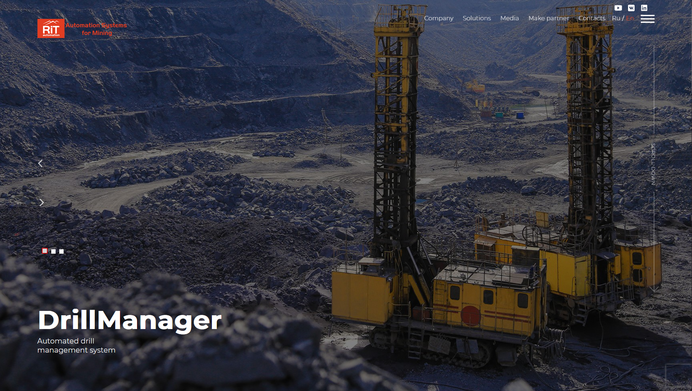

<h1 align="center">Demo project UI automation for <a href="https://rit-it.com/en/ ">rit-it.com</a></h1>

<h3>Содержание:</h3>

0. [Технологии](#tech)
1. [Список проверок](#listOfTest) 
2. [Запуск тестов](#testLaunch) 
    1. [Локальный](#localLaunch)
    2. [Удаленный (Selenoide)](#remoteLaunch)
3. [Отчетность](#report)
   1. [Allure](#allureReport)
   2. [Telegram](#telegramReport)

<h3>Технологии</h3>

<code></code>
<code></code>
<code></code>
<code></code>
<code></code>
<code></code>
<code></code>
<code></code>

<h3>Список проверок</h3>
